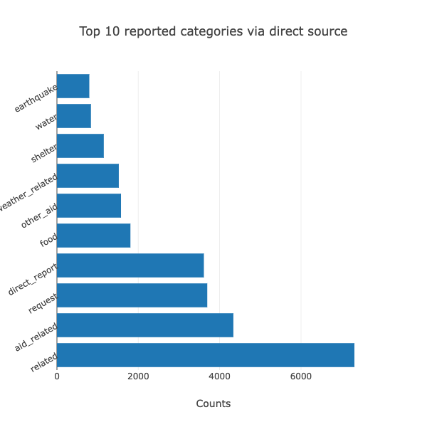

# Disaster Response Pipeline Project
This is a project where we analyze messages sent during natural disasters, provided by [Figure Eight](https://appen.com/#data_for_ai), and build a multi-output random forest classifier model to classify those messages into 36 different categories.

### Table of Contents
1.[Project Summary](#summary)

2.[File Discriptions](#files)

3.[Instructions to Run Scripts](#instructions)

4.[Classification Results and Discussion](#results)

5.[Licensing, Authors, and Acknowledgements](#licensing)

## 1. Project Summary 
This project analyzes real messages, provided by [Figure Eight](https://appen.com/#data_for_ai), which were reported during natural disasters either directly by people in affected areas or via news and social media. The eventual goal of the project is to classify these messages into different categories (such as fire, earthquakes, basic necessities, etc.) so that the corresponding disaster response organizations can act effectively in a timely manner. The three main components of this project are:

-  ETL pipeline: reads the message and category datasets from csv files, cleans the data and stores it in an SQLite database.

- ML pipeline: splits the data into train and test sets, then utilizes NLTK, scikitlearn's pipeline, and GridSearchCV to build a multi-output random forest classifier model. This model will take on the `message` to predict classification for 36 categories.

- Flask web app: implements the machine learning model to classify new messages entered by users. This web app also includes some data visualizations based on the train dataset.

## 2. File Descriptions 
Below are short descriptions of the folders and files in the repository:
- app (Flask web application)
    - templates
        - go.html (classification page of the web app)
        - master.html (home page of the web app)
    - run.py (Flask file to run the web app)

- data
    - disaster_categories.csv (category dataset)
    - disaster_messages.csv (message dataset)
    - ETL Pipeline Preparation.ipynb (Jupyter notebook to develop source code for ETL pipeline)
    - ML Pipeline Preparation.ipnyb (Jupyter notebook to develop source code for ML pipeline)
    - process_data.py (script for data cleaning pipeline)
    - DisasterResponse.db (database that stores cleaned data)
- models
    - train_classifier.py (script for ML pipeline)
- READme.md

## 3. Instructions to Run Scripts 
- Run the following commands in the project's root directory to set up your database and model
    - To run ETL pipeline that cleans data and stores in database
        `python data/process_data.py data/disaster_messages.csv data/disaster_categories.csv data/DisasterResponse.db`
    - To run ML pipeline that trains classifier and saves
        `python models/train_classifier.py data/DisasterResponse.db models/classifier.pkl`

        _Note: depending on the version of scikitlearn, this code at line 94 in the `train_classifier.py` script may not work. In that case can try to remove the argument `zero_division = 0`_

        `print(classification_report(Y_test, Y_pred, zero_division = 0, target_names=category_names))`

- Run the following command in the app's directory to run your web app.
    `python run.py`

- Go to http://0.0.0.0:3001/

## 4. Classification results and Discussion 
This model returns an average precision, recall, and F1-score of 0.66, 0.48, and 0.51, respectively. These are not high scores, but due to limitation of computer resources, we could only consider two parameters for the GridSearchCV: `use_idf` from the `TfidfTransformer` and `n_estimators` from the `RandomForestClassifier`. To optimize the model even more, we could have fine-tuned additional parameters such as `ngram_range`, `max_df`, `max_features` from the  `CountVectorizer`, or `min_samples_split` from `RandomForestClassifier`. etc.

The fact that the dataset is imbalanced also has an effect on training the model. Below is a graph showing the number of reports for each of the 36 categories in the dataset. Categories with significantly fewer observations would result in lower support values for the training process, hence a less reliable model.

The difference between prediction results for categories with high and low samplings can be seen in the example below, where we enter a message such as _`we are out in freezing wind, one person injured`_

The model succesfully classifies the message as `related` and `aid-related`, which have the highest observations in the training set. However, it fails to identify `hospitals` or `cold`, which rank relatively low in the graph above.

Besides evaluating the model, analyzing the dataset itself can also provide us some helpful insights. During natural disasters, messages can be generated via direct reports from people in the affected area, news sources, or social media. Social media, however, lags behind in the number of communications. A reason for this could be limited Internet access at the output of the disaster. This could inform the disaster response organizations to put priority in monitoring reports from direct and news sources during those times.

In addition, looking at the two graphs below for top categories reported via direct source and news, it is obvious that demands for basic necessities such as food and water are more likely to be reported by the affected people themselves. So if an organization is responsible for that part of the problems, they should pay more attention to communications from direct source.

(news.png)

## 5. Licensing, Authors, and Acknowledgements 
The datasets were provided to [Udacity](udacity.com) by [Figure Eight](https://appen.com/#data_for_ai)
